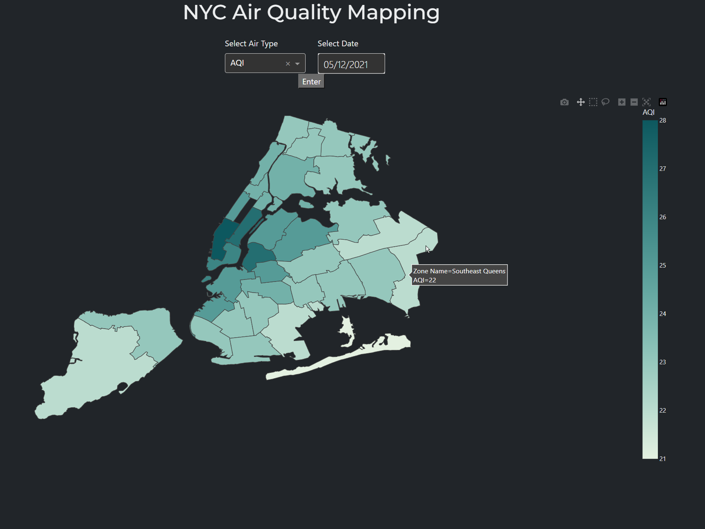
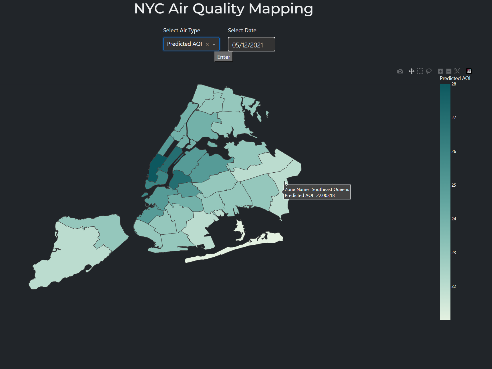

[![Contributors][contributors-shield]][contributors-url]
[![Forks][forks-shield]][forks-url]
[![Stargazers][stars-shield]][stars-url]
[![Issues][issues-shield]][issues-url]
[![MIT License][license-shield]][license-url]
[![LinkedIn1][linkedin-shield]][linkedin-url1]
[![LinkedIn2][linkedin-shield]][linkedin-url2]
[![LinkedIn3][linkedin-shield]][linkedin-url3]

# NYC Air Quality Data Analysis and Predictions
Authors: Veronica Koval, Mohammad Kahaf Bhuiyan, Panagiotis (Peter) Kokolis

## Showcase
The following two images show the view of the app for the same data parameter. The first is for historical AQI and the second is predicted AQI.
 

## Goal
Air quality in New York City has become an increasingly pressing issue among residents in recent years. Given the city’s population density and its subsequent consequences, such as increased traffic, domestic fuel burning, etc., the health risks associated with smog are no longer negligible. According to NYC.gov, New York’s official government website, air pollutants in New York City “...cause about 2,400 deaths per year in NYC, and thousands more emergency department visits and hospitalizations for asthma, heart and lung problems.” In 2023, NYC’s AQI, air quality index used to measure harmful particles in the air, reached an all time high at 460, the worst in the world, due to nearby Canadian wildfires. The topic of air quality is now among the list of major concerns to New Yorkers. Our goal is to model and track the air quality in order to help those more susceptible to health issues gauge the safety of their environment.

## Description
This project focuses on analyzing and predicting air quality in New York City. Our goal is to provide residents with valuable insights into the environmental quality of their neighborhoods, highlighting the presence of various air pollutants. Using data sourced from NYC Open Data and other external datasets, we have developed a sophisticated model. This model not only tracks and visualizes historical air quality trends but also employs predictive analytics to forecast future air quality scenarios based on observed data patterns.

## Built With
[![Python][Python]][Python-url]
[![Numpy][Numpy]][Numpy-url]
[![Pandas][Pandas]][Pandas-url]
[![OpenCV][OpenCV]][OpenCV-url]
[![Pytorch][Pytorch]][Pytorch-url]
[![Dash][Dash]][Dash-url]
[![Scikit-Learn][Scikit-Learn]][Scikit-Learn-url]

## How to Use
- To launch the Dash application for visualizing the air quality data, run the `run_dash_app.py` file.
- Select one of the available options from dropdown under "Select Air Type". For the predictive model, press 'Predicted AQI'.
- Select a date from under 'Select Date'. You can either type it in in the given format, or press date on the calendar pop up.
  - Dates can range anywhere from 2009-06-08 to 2021-12-31. For 'Predicted AQI' the date 2022-01-01 is also available.
- Press Enter.
- Hover mouse over zone for specific information.
- To change the parameters, repeat the process

## Models
- Several experimental models were used throughout the development of this project, which can be found in the `models` folder.
- The code for these models can be found in the `src/models` folder and include:
  - LSTM (Long Short Term Memory), a recurrent neural network model
  - STGNN (Spatio-temporal Graph Neural Net)
  - GCNInformer, a hybrid between GCN (Graph Convulutional Network) and Informer (A variation on Transformer models)

## Sources
- [**NYC Air Quality Dataset**](https://data.cityofnewyork.us/Environment/Air-Quality/c3uy-2p5r): This dataset provides comprehensive air quality surveillance data across different neighborhoods in New York City.
- [**NYC_geography**](https://github.com/nycehs/NYC_geography): A great resource for geographic boundaries of NYC, including the geoJSON files used for this project.
- [**Informer**](https://github.com/zhouhaoyi/Informer2020): A new machine learning model based on Transformer models for Long Sequence Time-Series Forecasting, winner of AAAI'21 Best Paper.

## Contributors
- Panagiotis (Peter) Kokolis: [**LinkedIn**](https://www.linkedin.com/in/panagiotis-kokolis), [**GitHub**](https://github.com/PanagiotisKokolis)
- Mohammad Kahaf Bhuiyan: [**LinkedIn**](https://www.linkedin.com/in/mkbhuiyan96/), [**GitHub**](https://github.com/mkbhuiyan96)
- Veronica Koval: [**LinkedIn**](https://www.linkedin.com/in/veronicakoval), [**GitHub**](https://github.com/VerKoval/)

[contributors-shield]: https://img.shields.io/github/contributors/VerKoval/AirQualityModel.svg?style=for-the-badge
[contributors-url]: https://github.com/VerKoval/AirQualityModel/graphs/contributors
[forks-shield]: https://img.shields.io/github/forks/VerKoval/AirQualityModel.svg?style=for-the-badge
[forks-url]: https://github.com/VerKoval/AirQualityModel/network/members
[stars-shield]: https://img.shields.io/github/stars/VerKoval/AirQualityModel.svg?style=for-the-badge
[stars-url]: https://github.com/VerKoval/AirQualityModel/stargazers
[issues-shield]: https://img.shields.io/github/issues/VerKoval/AirQualityModel.svg?style=for-the-badge
[issues-url]: https://github.com/VerKoval/AirQualityModel/realesrgan/issues
[license-shield]: https://img.shields.io/github/license/VerKoval/AirQualityModel.svg?style=for-the-badge
[license-url]: https://github.com/VerKoval/AirQualityModel/blob/main/LICENSE
[linkedin-shield]: https://img.shields.io/badge/-LinkedIn-black.svg?style=for-the-badge&logo=linkedin&colorB=0077B5
[linkedin-url1]: https://www.linkedin.com/in/panagiotis-kokolis
[linkedin-url2]: https://www.linkedin.com/in/mkbhuiyan96/
[linkedin-url3]: https://www.linkedin.com/in/veronicakoval
[Python]: https://img.shields.io/badge/python-FFDE57?style=for-the-badge&logo=python&logoColor=4584B6
[Python-url]: https://www.python.org/
[Numpy]: https://img.shields.io/badge/numpy-%23013243.svg?style=for-the-badge&logo=numpy&logoColor=white
[Numpy-url]: https://numpy.org/
[Pandas]: https://img.shields.io/badge/Pandas-150458?style=for-the-badge&logo=pandas&logoColor=white
[Pandas-url]: https://pandas.pydata.org/
[Python]: https://img.shields.io/badge/python-FFDE57?style=for-the-badge&logo=python&logoColor=4584B6
[Python-url]: https://www.python.org/
[OpenCV]: https://img.shields.io/badge/opencv-000000?style=for-the-badge&logo=opencv&logoColor=00ff00
[OpenCV-url]: https://opencv.org/
[Pytorch]: https://img.shields.io/badge/pytorch-%23EE4C2C.svg?style=for-the-badge&logo=pytorch&logoColor=white
[Pytorch-url]: https://pytorch.org/
[Dash]: https://img.shields.io/badge/Dash-Plotly-white?style=for-the-badge&logo=plotly&logoColor=red
[Dash-url]: https://dash.plotly.com/
[Scikit-Learn]: https://img.shields.io/badge/scikit--learn-black?style=for-the-badge&logo=scikit-learn
[Scikit-Learn-url]: https://scikit-learn.org/
